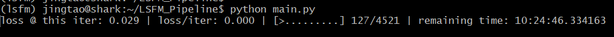

# LSFM Pipeline


This is a pipeline for aligning 3D point clouds and generate LSFM models. For more details, please check [Optimal Step Nonrigid ICP Algorithms for Surface Registration](https://gravis.dmi.unibas.ch/publications/2007/CVPR07_Amberg.pdf).

# Contents
## 1 How to use our Pipeline
### 1.1 Programming environment
### 1.2 Basic usage
### 1.3 Default hyper-parameters
### 1.4 Customize pipeline
## 2 Tutorial: Dive into our Pipeline
### 2.1 Mesh cloud loader: 
how to load mesh clouds and transform them into the same size
### 2.2 Equation solver: 
how to make it run `10x` times faster
### 2.3 Non-ICP algorithm: 
what is the core algorithm to align mesh clouds from different point-of-view
### 2.4 Integrate all: 
how we build up the whole pipeline

<br>

## 1 How to use our Pipeline
### 1.1 Programming Environment
Use `menpo`. For details, please check [Menpo](https://www.menpo.org/installation/).
### 1.2 Basic usage
````
p = Pipeline(base_model_path)
lsfm, logs = p.run(input_path)

// to use LSFM model, use lsfm
// to have a look at training logs, take logs
````



LSFM will run for many `epochs`. Each `epoch` will run for many `iterations`. Weights for each epoch and other hyper-parameters are already handled in `config.ini`.

### 1.3 Default hyper-parameters
The `config.ini` is as follows:

[DEFAULT]
* `DEFAULT_OUTPUT_PATH = ./output` save models and intermediate data into that directory.
* `DEFAULT_STIFFNESS_WEIGHTS = [50, 20, 5, 2, 0.8, 0.5, 0.35, 0.2]` stiffness weights for each `epoch`
* `VAR = [85, 300, 220]` mesh cloud variance in 3 dimensions
* `CENTER = [0, 0, 0]` mesh cloud center
* `SOLVER = umfpack` mathematical solver, 'umfpack' or 'naive'
* `MAX_ITER = 10` max number of `iterations` for each `epoch`
* `EPS = 1e-3` epsilon
* `MAX_NUM_POINTS = 2000` max number of points retained for each mesh cloud
* `N_COMPONENTS = 0.997` number of components (mesh clouds) retained, if it's within $(0,1)$, then k largest components are retained to reach the variance of `N_COMPONENTS`; otherwise `N_COMPONENTS` largest components are remained.
* `MESH_FILE_EXTENSIONS = [OBJ,]` which kind of files are mesh files containing point clouds to be aligned
* `SAVING_FREQUENCY = 50` for every `SAVING_FREQUENCY` mesh files processed, we should save the current pipeline into `output_path` as backup
* `IS_PREEMPTIVE = True` whether to resume from previously results, if true, try to load the most updated pipeline model saved from `output_path` and re-run the pipeline from that point
* `VERBOSE = True` 

### 1.4 Customized pipeline
Also, you can customize the above parameters and use them to construct your *Pipeline* model with the construtor function. In particular, a constructor parameter `data_weights` should be of the same length as that of `stiffness_weights`. In general, you can take it as `None` and ignore it.

## 2. Tutorial: Dive into our Pipeline
For the details about implementing and testing different parts of our pipeline, please check LSFM notebook.
